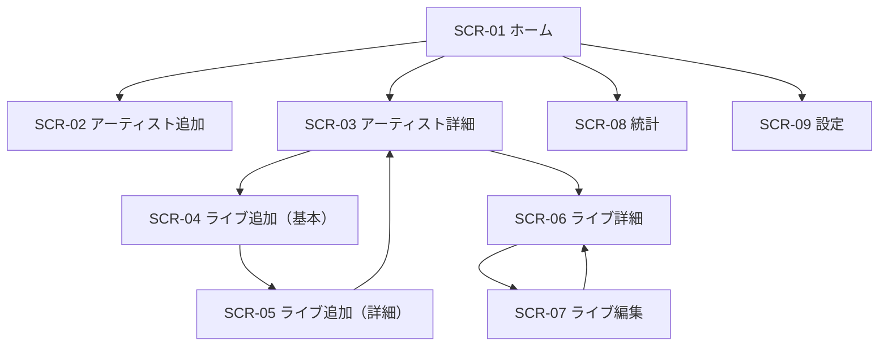

## 画面一覧

## 1. 文書概要

|項目|内容|
|---|---|
|対象システム|LiveCloud|
|対象リリース|現行実装を基準とした初版|
|作成日|2026-08-18|
|画面数|9画面|

本書では、利用者が直接操作する画面と、その遷移先を整理する。URLはHash Routerによるルートを示すため、実際のアクセス時には `#/` が先頭に付く。

## 2. 画面一覧

|No.|画面名|ルート|実装コンポーネント|概要|
|---:|---|---|---|---|
|SCR-01|ホーム|`/`|`Home`|登録アーティストの検索・一覧表示と主要画面への入口。|
|SCR-02|アーティスト追加|`/add-artist`|`AddArtist`|アーティスト名と任意のプロフィール画像を登録する。|
|SCR-03|アーティスト詳細|`/artist/:artistId`|`ArtistDetail`|アーティストごとのライブ履歴・基本情報を確認し、ライブ追加や削除を行う。|
|SCR-04|ライブ追加（基本）|`/artist/:artistId/add-live`|`AddLiveBasic`|ライブの基本情報を入力する登録フローの第1段階。|
|SCR-05|ライブ追加（詳細）|`/artist/:artistId/add-live/detail`|`AddLiveDetail`|評価、セットリスト、写真、感想を入力して登録する第2段階。|
|SCR-06|ライブ詳細|`/live/:artistId/:liveId`|`LiveDetail`|登録済みライブの詳細を閲覧し、編集・削除を行う。|
|SCR-07|ライブ編集|`/artist/:artistId/live/:liveId/edit`|`EditLive`|ライブの基本情報・詳細・写真を更新する。|
|SCR-08|統計|`/stats`|`Stats`|参加回数のサマリー、推移、アーティスト別集計を確認する。|
|SCR-09|設定|`/settings`|`Settings`|JSONバックアップと保存状況を確認する。|

## 3. 画面構成

## 4. 画面詳細

### SCR-01 ホーム

|項目|内容|
|---|---|
|目的|登録済みアーティストを探し、各アーティストのライブ記録や主要機能へ移動する。|
|主な表示|ヘッダー、アーティスト検索欄、アーティスト数、最終参戦日順のアーティストカード、フローティング追加ボタン、ボトムナビゲーション。|
|主な操作|アーティスト名による絞り込み、アーティスト詳細の表示、アーティスト追加、統計・設定画面への移動。|
|空状態|検索条件に一致するアーティストがいない場合、「該当するアーティストが見つかりません」と表示する。|

アーティストカードには、名称、ライブ参加回数、最終参戦日、プロフィール画像を表示する。アーティストは最終参戦日の新しい順で表示する。

### SCR-02 アーティスト追加

|項目|内容|
|---|---|
|目的|新しく管理するアーティストを登録する。|
|入力項目|アーティスト名（必須）、プロフィール画像（任意）。|
|主な操作|画像の選択・変更、登録、登録の中止。|
|入力制御|画像以外のファイルと20 MBを超える元画像を受け付けない。名称が空の場合は登録しない。|
|完了時の遷移|登録成功後、ホームへ戻る。|

選択した画像は登録前にプレビュー表示する。保存時は画像を圧縮してストレージに登録し、処理失敗時には作成済みデータの後片付けを試みる。

### SCR-03 アーティスト詳細

|項目|内容|
|---|---|
|目的|特定アーティストの参加履歴を確認し、ライブ記録を管理する。|
|主な表示|アーティスト名、画像、ライブ参加回数、ライブ一覧／基本情報のタブ、ライブ追加ボタン、ボトムナビゲーション。|
|主な操作|タブ切替、ライブ詳細の表示、ライブ追加、ライブ削除、アーティスト削除、ホームへ戻る。|
|ライブ一覧|開催日の新しい順に、開催日、ライブ名、会場、代表画像を表示する。|
|基本情報|アーティスト名、ライブ参加回数、最終参戦日を表示する。|
|空状態|ライブが未登録の場合、追加を促すメッセージを表示する。|

アーティスト削除は確認後に実行する。削除すると、そのアーティストに紐付くライブ記録も削除対象となる。

### SCR-04 ライブ追加（基本）

|項目|内容|
|---|---|
|目的|ライブ登録に必要な基本情報を入力する。|
|進捗表示|`STEP 1 / 2`。|
|入力項目|ライブ名（必須）、ライブ種別、開催日（必須）、会場（必須）、開場時刻、開演時刻、座席。|
|ライブ種別|ワンマン、フェス、対バン、イベント。初期値はワンマン。|
|主な操作|前画面へ戻る、次へ進む。|
|入力制御|ライブ名・開催日・会場が未入力の場合は次へ進めない。|

次へ進むと、入力した基本情報を画面遷移時の状態としてSCR-05へ引き渡す。

### SCR-05 ライブ追加（詳細）

|項目|内容|
|---|---|
|目的|ライブの思い出となる任意情報を入力し、記録を保存する。|
|進捗表示|`STEP 2 / 2`。|
|入力項目|評価、セットリスト、写真、感想メモ。すべて任意。|
|セットリスト|曲、MC、ENCOREを追加・削除できる。曲には曲名を入力する。|
|写真|複数の画像を選択でき、選択枚数を表示する。|
|主な操作|前画面へ戻る、評価の選択、項目追加・削除、写真選択、登録。|
|完了時の遷移|登録成功後、対象アーティスト詳細へ戻る。|

基本情報が引き渡されていない状態で直接開いた場合は、入力画面へ戻る導線を表示する。

### SCR-06 ライブ詳細

|項目|内容|
|---|---|
|目的|登録済みライブの内容を振り返り、編集または削除する。|
|主な表示|ライブ名、開催日、会場、ライブ種別、開場・開演時刻、座席、評価、セットリスト、写真、感想メモ。|
|主な操作|アーティスト詳細へ戻る、編集画面へ移動、ライブ削除、ライブ写真の削除。|
|削除時の扱い|確認後にライブ本体と関連データを削除し、保存済み写真の削除を試みる。|

### SCR-07 ライブ編集

|項目|内容|
|---|---|
|目的|登録済みライブの情報を更新する。|
|主な表示・入力|ライブ名、ライブ種別、開催日、会場、開場・開演時刻、座席、評価、セットリスト、写真、感想メモ。|
|主な操作|各項目の編集、セットリストの追加・削除、写真の追加・削除、保存、前画面へ戻る。|
|完了時の遷移|保存成功後、対象ライブ詳細へ戻る。|

### SCR-08 統計

|項目|内容|
|---|---|
|目的|ライブ参加の傾向を全体・時系列・アーティスト別に振り返る。|
|タブ|サマリー、推移、アーティスト別。|
|サマリー|総ライブ参加数、今年の参加数、最も参戦したアーティスト、アーティスト別平均参加数、参加割合の円グラフを表示する。|
|推移|年別参加回数の棒グラフと、当年の月別参加回数の折れ線グラフを表示する。|
|アーティスト別|アーティスト別の参加回数を降順ランキングで表示する。|
|共通操作|ボトムナビゲーションからホーム、アーティスト追加、設定へ移動できる。|

データがない場合は、ライブまたはアーティストの登録を促す空状態を表示する。

### SCR-09 設定

|項目|内容|
|---|---|
|目的|記録データのバックアップと保存状況を確認する。|
|主な表示|データ管理、写真管理、通知、アプリ情報の各セクション、保存ライブ数、写真数、最終バックアップ日時。|
|実装済み操作|JSONバックアップのダウンロード。|
|未実装操作|JSONからの復元、不要写真の整理、通知設定、ライブ予定、やりたいことリスト、アプリ情報。これらは無効状態で表示する。|
|共通操作|ボトムナビゲーションからホーム、統計、アーティスト追加へ移動できる。|

## 5. 共通UI・遷移ルール

### 5.1 ボトムナビゲーション

ホーム、統計、アーティスト追加、設定の4項目を表示する。ホーム、統計、設定、およびアーティスト詳細で共通して利用できる。

### 5.2 戻る操作

- アーティスト追加はホームへ戻る。
- ライブ追加・ライブ編集は直前の画面へ戻る。
- ライブ詳細はアーティスト詳細へ戻る。
- URL上の対象アーティストまたはライブが見つからない場合は、対象なしのメッセージと復帰導線を表示する。

### 5.3 データ更新後の表示

登録、編集、削除が成功した場合、関連する画面で一覧・件数・最終参戦日が更新された状態を表示する。処理に失敗した場合は、エラーメッセージを表示し、成功したものとして画面遷移しない。
