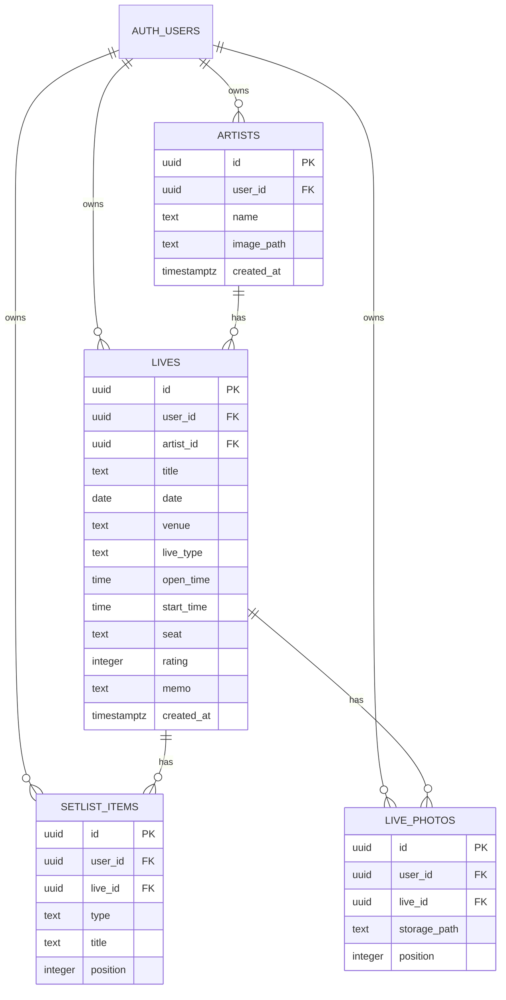

## データ設計

## 1. 文書概要

|項目|内容|
|---|---|
|対象システム|LiveCloud|
|作成日|2026-08-19|
|対象|Supabase Auth、PostgreSQL、Supabase Storage、完全バックアップZIP|

本書は、現在のアプリケーション実装で利用する永続データの構造と運用方針を定義する。データベースはSupabase PostgreSQL、画像ファイルはSupabase Storageの非公開バケットに保存する。

## 2. データモデル概要



`user_id` は全データを匿名認証を含むSupabase Authユーザーへ紐付けるための所有者キーである。子テーブルにも `user_id` を持たせ、RLSでユーザー単位の参照・更新範囲を明確にする。

## 3. テーブル定義

### 3.1 `artists`

アーティストの基本情報とプロフィール画像の保存先を管理する。

|列名|型|NULL|既定値|説明|
|---|---|---:|---|---|
|`id`|`uuid`|不可|UUID自動採番|アーティストID。主キー。|
|`user_id`|`uuid`|不可|なし|所有者。`auth.users.id` を参照する。|
|`name`|`text`|不可|なし|アーティスト名。|
|`image_path`|`text`|可|`null`|`artist-images` バケット内の画像パス。署名付きURLは保存しない。|
|`created_at`|`timestamptz`|不可|`now()`|作成日時。|

### 3.2 `lives`

ライブ・コンサートの基本情報と感想を管理する。

|列名|型|NULL|既定値|説明|
|---|---|---:|---|---|
|`id`|`uuid`|不可|UUID自動採番|ライブID。主キー。|
|`user_id`|`uuid`|不可|なし|所有者。`auth.users.id` を参照する。|
|`artist_id`|`uuid`|不可|なし|所属アーティスト。`artists.id` を参照する。|
|`title`|`text`|不可|なし|ライブ名。|
|`date`|`date`|可|`null`|開催日。|
|`venue`|`text`|可|`null`|会場名。|
|`live_type`|`text`|可|`null`|ライブ種別（ワンマン、フェス、対バン、イベント）。|
|`open_time`|`time`|可|`null`|開場時刻。|
|`start_time`|`time`|可|`null`|開演時刻。|
|`seat`|`text`|可|`null`|座席情報。|
|`rating`|`integer`|可|`0`|評価。0は未評価、1〜5は評価値。|
|`memo`|`text`|可|`null`|感想メモ。|
|`created_at`|`timestamptz`|不可|`now()`|作成日時。|

### 3.3 `setlist_items`

ライブ内のセットリストを表示順とともに管理する。

|列名|型|NULL|既定値|説明|
|---|---|---:|---|---|
|`id`|`uuid`|不可|UUID自動採番|セットリスト項目ID。主キー。|
|`user_id`|`uuid`|不可|なし|所有者。`auth.users.id` を参照する。|
|`live_id`|`uuid`|不可|なし|対象ライブ。`lives.id` を参照する。|
|`type`|`text`|不可|なし|`song`、`mc`、`encore` のいずれか。|
|`title`|`text`|可|`null`|曲名。`type = song` の場合のみ利用する。|
|`position`|`integer`|不可|なし|ライブ内の表示順。1から連番。|

### 3.4 `live_photos`

ライブ写真のStorageパスと表示順を管理する。画像バイナリはDBへ保存しない。

|列名|型|NULL|既定値|説明|
|---|---|---:|---|---|
|`id`|`uuid`|不可|UUID自動採番|ライブ写真ID。主キー。|
|`user_id`|`uuid`|不可|なし|所有者。`auth.users.id` を参照する。|
|`live_id`|`uuid`|不可|なし|対象ライブ。`lives.id` を参照する。|
|`storage_path`|`text`|不可|なし|`live-photos` バケット内の画像パス。|
|`position`|`integer`|不可|なし|ライブ内の表示順。1から連番。|

## 4. 整合性制約とインデックス

|対象|定義|
|---|---|
|主キー|各テーブルの`id`を主キーとする。|
|所有者参照|各テーブルの`user_id`は`auth.users(id)`を参照する。|
|親子参照|`lives.artist_id`は`artists(id)`、`setlist_items.live_id`および`live_photos.live_id`は`lives(id)`を参照する。|
|連鎖削除|アーティスト削除時はライブ、セットリスト、写真レコードを、ライブ削除時はセットリスト・写真レコードを連鎖削除する。Storage上の画像はアプリケーション処理で削除する。|
|評価|`rating`は0〜5の整数に制限する。|
|セットリスト種別|`type`は`song`、`mc`、`encore`に制限する。|
|表示順|`setlist_items`と`live_photos`は、同一`live_id`内で`position`を一意にする。|

推奨するインデックスは次のとおりとする。

|インデックス|目的|
|---|---|
|`artists(user_id, created_at)`|ユーザー単位のアーティスト一覧取得。|
|`lives(artist_id, date desc)`|アーティスト詳細でのライブ一覧取得。|
|`lives(user_id, date)`|ユーザー単位の統計集計。|
|`setlist_items(live_id, position)`|セットリストの順序付き取得。|
|`live_photos(live_id, position)`|ライブ写真の順序付き取得。|

## 5. Storage設計

いずれのバケットも非公開とする。画面表示にはStorageパスから生成した有効期限1時間の署名付きURLを用いる。

|バケット|用途|オブジェクトパス|保存形式|
|---|---|---|---|
|`artist-images`|アーティストのプロフィール画像|`{user_id}/{artist_id}/profile.{ext}`|登録時に最大1200×1200px・JPEG品質80%へ圧縮。|
|`live-photos`|ライブ写真|`{user_id}/{live_id}/{uuid}.{ext}`|登録時に最大1600×1600px・JPEG品質75%へ圧縮。|

画像パスの先頭に所有者の`user_id`を含める。これにより、Storageポリシーで先頭階層と `auth.uid()` の一致を検査できる。

## 6. Row Level Security（RLS）方針

各テーブルでRLSを有効化し、匿名ユーザーを含め、`user_id = auth.uid()` を満たす行だけに操作を限定する。

|操作|許可条件|
|---|---|
|`SELECT`|対象行の`user_id = auth.uid()`。|
|`INSERT`|新規行の`user_id = auth.uid()`。|
|`UPDATE`|更新前後の`user_id = auth.uid()`。|
|`DELETE`|対象行の`user_id = auth.uid()`。|
|Storage操作|オブジェクトパス先頭の`user_id`が`auth.uid()`と一致する。|

子テーブルへの登録時は、`live_id`が同一ユーザーのライブを参照していることもポリシーまたはトリガーで検証する。

## 7. 完全バックアップ形式

設定画面で作成する完全バックアップは `LiveCloud_complete_YYYY-MM-DD.zip` とする。形式バージョンは現在 `2.0.0` である。

```text
LiveCloud_complete_YYYY-MM-DD.zip
├─ backup.json
├─ images/
│  ├─ artists/
│  │  └─ {連番}.{ext}
│  └─ lives/
│     └─ {アーティスト連番}-{ライブ連番}/
│        └─ {連番}.{ext}
```

`backup.json` にはアーティスト、ライブ、セットリストと、ZIP内画像への相対パスを格納する。バックアップにはユーザーID、DBレコードID、既存Storageパス、署名付きURLを含めない。

復元時はZIPの構造と参照画像の存在を検証してから、現在のデータを置き換える。復元先では新しい`id`とStorageパスを生成するため、別ブラウザで匿名ユーザーが新規作成された場合でも、バックアップを通じてデータを移行できる。

## 8. アプリケーション用データ型との対応

画面ではDBの列名をReact用のキャメルケースへ変換して扱う。

|DB / Storage|Reactのデータ|
|---|---|
|`artists.id`|`Artist.id`|
|`artists.image_path`|署名付きURLを生成し`Artist.image`へ設定|
|`lives.artist_id`|`Live.artistId`|
|`lives.live_type`|`Live.liveType`|
|`lives.open_time`|`Live.openTime`|
|`lives.start_time`|`Live.startTime`|
|`setlist_items`|`Live.setlist`（`position`順）|
|`live_photos.storage_path`|署名付きURLを生成し`Live.photos`へ設定（`position`順）|
|`Artist.liveCount` / `Artist.lastLiveDate`|ライブ配列から算出する表示用の導出値。DBへは保存しない。|

## 9. 運用上の注意

- 匿名認証のセッションを失うと、そのユーザーの行へ直接アクセスできなくなる。端末・ブラウザを変更する前に完全バックアップを作成する。
- 署名付きURLには有効期限があるため、DBやバックアップへ保存しない。
- DBの連鎖削除とStorageの削除は単一トランザクションにできない。ストレージ削除が失敗した場合は不要ファイルが残る可能性があり、将来的な監査・再試行の対象とする。
